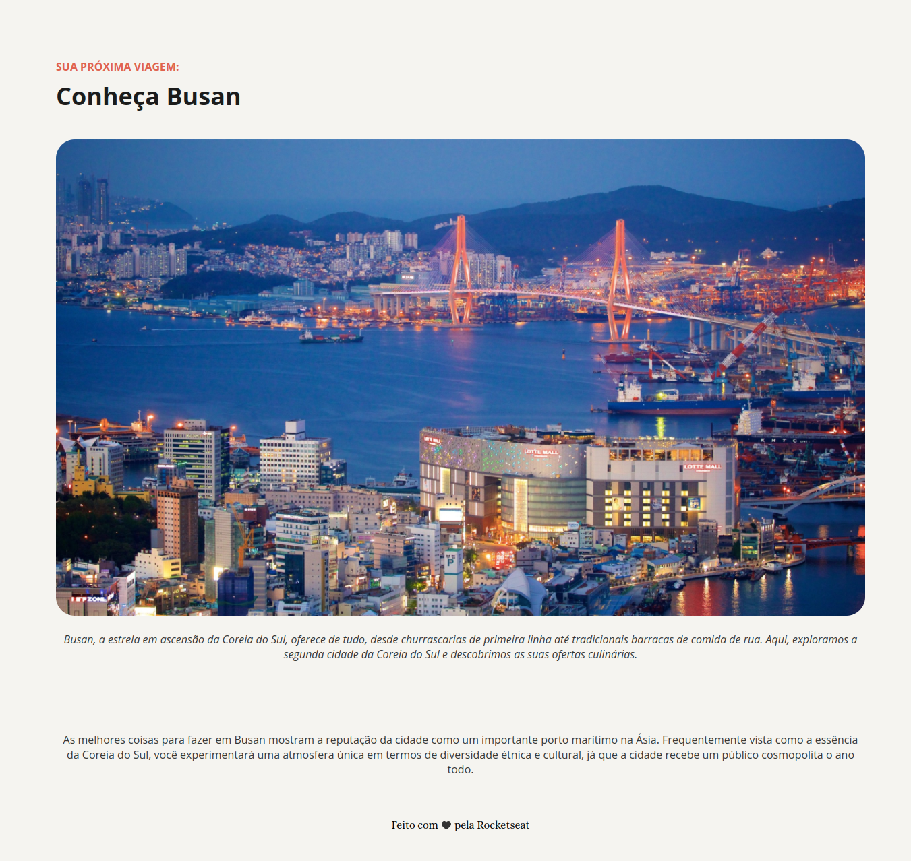

# 🏯 Local Turístico: Conheça Busan

> Formação Full-Stack: Iniciando o HTML e CSS (desafio prático)

O projeto é uma simples página de turismo que exibe três destinos imperdíveis em Busan, Coreia do Sul.

[🔗 Clique aqui para acessar](https://github.com/lucasnikerj7/projeto-local-turistico)

## 🛠️ Tecnologias

- HTML

- CSS

- Git e Github

##  🧑🏻‍💼 Contato

- 📧 lucas.alonso99@gmail.com 

- 🟦 https://www.linkedin.com/in/lucasgfalonso/

